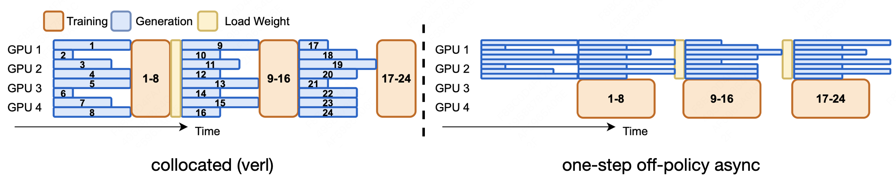
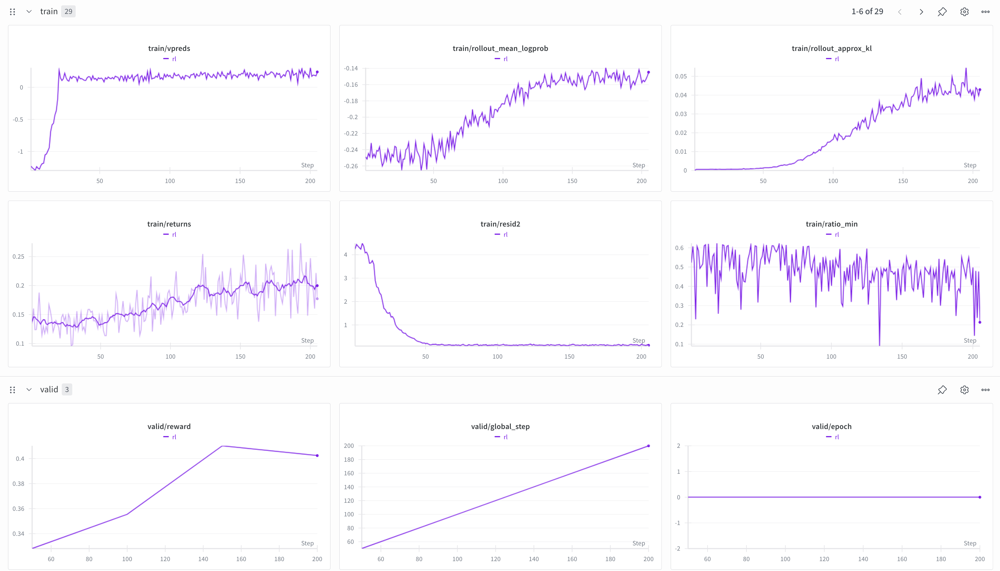

# nanoRLHF

<p align="center">

[](https://github.com/karpathy/nanoGPT)

</p>

This project aims to perform RLHF training from scratch, implementing almost all core components manually except for PyTorch and Triton. Each module is a minimal, educational reimplementation of large-scale systems focusing on clarity and core concepts rather than production readiness. This includes an SFT and RL training pipeline with evaluation, for training a small Qwen3 model on open-source math datasets.

## Motivation
A few years ago, it still felt possible for an individual to meaningfully train and contribute a model, and I was fortunate to do so with [Polyglot-Ko](https://github.com/EleutherAI/polyglot), the first commercially usable open-source Korean LLM, despite not owning a single GPU, thanks to support from the open-source community. But as the field entered an era where large companies train [massive](https://huggingface.co/deepseek-ai/DeepSeek-R1) [models](https://huggingface.co/Qwen/Qwen3-235B-A22B) at unimaginable scale and release them freely, individual efforts began to feel small by comparison. The same shift happened in libraries. [Open sources](https://github.com/volcengine/verl) [maintained](https://github.com/NVIDIA/Megatron-LM) [by full-time corporate teams](https://github.com/langchain-ai/langchain) quickly outpaced what a single person could sustainably build or maintain. I have always loved developing my own open source, but in this reality, facing clear limits in time and capital, I found myself stepping back from it for a while. Eventually, I reframed the question, not how to compete, but how a single person could still create something genuinely useful. Inspired by projects like [Karpathy’s nano series](https://github.com/karpathy/nanoGPT), I returned to building small, clear, educational implementations, focused not on scale or efficiency, but on understanding and teaching. Even without massive resources, I still believe that individuals can create meaningful work that influences and helps others.

## Takeaways
This repository is best approached as a learn-by-building course. The goal is not just to run RLHF once, but to understand the moving parts well enough that you can modify them confidently.

By the end, you should be able to:
- Understand how datasets become efficient columnar storage.
- Reason about distributed execution and why large training pipelines require it.
- Understand parallelism and how training is scaled across GPUs.
- Recognize why certain kernels matter and what they optimize.
- Understand what makes inference fast in practice.
- Tie everything together into a RLHF training workflow.

If you learn these pieces in a clean, minimal codebase, you get practical, on-the-job benefits:
- **Easier debugging in real-world frameworks**: when something goes wrong in libraries like `verl` or `NeMo-RL` (wrong outputs, hangs, weird throughput, silent performance regressions), you can reason from first principles about where the issue likely lives and trace it quickly without treating the framework as a black box.
- **Better at extending and customizing systems-style code**: because you become comfortable reading and writing minimal implementations of the same building blocks, adding features (or making targeted custom changes) in larger codebases becomes much more approachable and less risky.
- **Stronger bottleneck analysis and performance tuning**: when efficiency drops, you can map symptoms to the correct layer (data format & copying, scheduling/execution, parallelism/collectives, kernels/attention, inference caching) and focus your optimization effort where it actually matters.

## Pre-requisites
I worked on this project using a single server with 8 * H200 GPUs.  
It should also run well on A100 80GB GPUs, but to fully experiment with all features including 3D parallelism, a server with at least 8 GPUs is required.

## Installation
In this project, internal APIs from libraries such as Hugging Face Transformers are used in a hackable way, so all dependency versions except PyTorch are strictly pinned.  
It is strongly recommended to run the code in an isolated environment such as a Conda virtual environment.

```bash
# 1) create conda environment
conda create -n nanorlhf python=3.10
conda activate nanorlhf

# 2) install PyTorch for your environment from https://pytorch.org/get-started/locally/
# e.g. pip install torch --index-url https://download.pytorch.org/whl/cu126

# 3) install nanoRLHF
git clone https://github.com/hyunwoongko/nanoRLHF
cd nanoRLHF
pip install -e .
```

## Learning path
I recommend finishing the course in this order:

1) Install the library. 
2) Study each module in the order below.
3) After finishing a module, run its example to validate your mental model.
4) Finally, run the full RLHF training pipeline following the README steps. 

The key idea is simple: learn the building blocks first, then run the end-to-end pipeline once you understand what each piece is responsible for.

### 1) `nanosets`
`nanosets` is a small, Arrow-like zero-copy dataset library. If you have used Apache Arrow or Hugging Face Datasets before, the goal here is to show what those fast dataset abstractions really mean under the hood—using minimal code that you can actually read end-to-end.

At the core, you should walk away with a concrete mental model of columnar data: values live in contiguous buffers, nulls are tracked separately (validity), variable-length data relies on offsets, and a schema defines how everything is interpreted. The key design idea is zero-copy: slicing, taking, and selecting often create views instead of materializing new Python objects, so dataset operations can stay cheap even at scale.

This matters because the data layer quietly determines how painful everything else becomes. If your pipeline is copy-heavy, the GPU waits. If memory layout is unclear, correctness bugs and performance regressions are hard to track down. Once you understand how a columnar, zero-copy dataset is represented, it becomes much easier to reason about where time and memory go—and why batch-oriented structures like `RecordBatch` and `Table` are such a natural fit for modern training workflows.

Resources:
- Implementation: [nanosets](https://github.com/hyunwoongko/nanorlhf/tree/main/nanorlhf/nanosets)
- Textbook: [available](https://github.com/hyunwoongko/nanoRLHF/tree/main/nanorlhf/nanosets/docs)
- Example: [available](https://github.com/hyunwoongko/nanorlhf/tree/main/examples/nanosets.py)
- References: [arrow](https://github.com/apache/arrow), [datasets](https://github.com/huggingface/datasets)

### 2) `nanoray`
`nanoray` is a tiny distributed computing engine inspired by Ray. The goal is not to replace Ray, but to make the “distributed execution layer” feel understandable: tasks, workers, scheduling, and what it means to move data between processes or machines.

When you study this module, you should focus on the mental model of execution. What is a task? Who executes it? How are workers created and reused? How does scheduling decide where work goes? What are the costs and failure modes when you pass data around?

This matters because RLHF pipelines are naturally concurrent: you often need multiple rollouts happening while rewards are computed and evaluations run. Many real-world issues show up as hangs, strange slowdowns, or throughput collapses that look mysterious until you understand the distributed layer. Once you can reason about scheduling and data movement, debugging these problems becomes much more grounded.

Resources:
- Implementation: [nanoray](https://github.com/hyunwoongko/nanorlhf/tree/main/nanorlhf/nanoray)
- Textbook: In progress
- Example: [available](https://github.com/hyunwoongko/nanorlhf/tree/main/examples/nanoray.py)
- References: [ray](https://github.com/ray-project/ray)

### 3) `nanotron`
`nanotron` is a minimal model and data parallelism engine inspired by Megatron-style training. This module is where scaling becomes an architectural problem: you are not just “using more GPUs,” you are choosing parallelism strategies and accepting communication costs.

The main thing to understand here is what each parallelism type is responsible for (data parallel, tensor parallel, pipeline parallel, and why 3D parallelism exists). You should also build intuition for where communication happens (all-reduce / all-gather patterns) and why those operations dominate scalability once the model is large.

This matters because most training failures and inefficiencies at scale come from mismatched parallelism choices, unstable collective patterns, or memory constraints that force awkward tradeoffs. Once you understand the mechanism, you are better equipped to tune throughput, memory usage, and stability without guessing.

Resources:
- Implementation: [nanotron](https://github.com/hyunwoongko/nanorlhf/tree/main/nanorlhf/nanotron)
- Textbook: Not started
- Example: [available](https://github.com/hyunwoongko/nanorlhf/tree/main/examples/nanotron.py)
- References: [Megatron-LM](https://github.com/NVIDIA/Megatron-LM), [oslo](https://github.com/EleutherAI/oslo)

### 4) `kernels`
`kernels` is a collection of Triton kernels inspired by projects like FlashAttention. The goal is to show why certain pieces of GPU code are worth special handling: many training workloads are bottlenecked not by high-level Python, but by a handful of extremely hot operations.

When studying this module, focus on the difference between compute and memory bottlenecks, and why attention-related operators tend to dominate runtime. You do not need to become a GPU kernel expert here; the goal is to understand what these kernels are optimizing for (memory traffic, launch overhead, fusion, and numerical stability tradeoffs).

This matters because systems performance often comes down to a few critical kernels. Even small improvements in a hot path can translate into large end-to-end speedups. More importantly, you gain intuition for what to measure and what to ignore when performance feels off.

Resources:
- Implementation: [kernels](https://github.com/hyunwoongko/nanorlhf/tree/main/nanorlhf/kernels)
- Textbook: Not started
- Example: [available](https://github.com/hyunwoongko/nanorlhf/tree/main/examples/kernels.py)
- References: [flash-attention](https://github.com/Dao-AILab/flash-attention/), [trident](https://github.com/kakaobrain/trident)

### 5) `nanovllm`
`nanovllm` is a small, high-performance inference engine inspired by vLLM. The central idea is that inference is not just “forward pass in eval mode.” It is a scheduling and memory-management problem: batching, request multiplexing, and KV-cache behavior often decide throughput.

While reading this module, focus on what makes inference fast in practice. How does batching work when requests have different lengths? What is the role of caching, and why does it change performance characteristics? Why does throughput-oriented inference look structurally different from training loops?

This matters because RLHF is generation-heavy. Rollouts and evaluation can become the dominant cost if inference throughput is poor. Understanding inference internals helps you design rollout and evaluation loops that are both correct and efficient.

Resources:
- Implementation: [nanovllm](https://github.com/hyunwoongko/nanorlhf/tree/main/nanorlhf/nanovllm)
- Textbook: Not started
- Example: [available](https://github.com/hyunwoongko/nanorlhf/tree/main/examples/nanovllm.py)
- References: [vllm](https://github.com/vllm-project/vllm), [nano-vllm](https://github.com/GeeeekExplorer/nano-vllm)

### 6) `nanoverl`
`nanoverl` is a minimal RLHF training framework inspired by verl and similar PPO-based systems. This module is where everything comes together: generation, reward computation / verification, advantage estimation, policy/value updates, and evaluation.

When studying this module, focus on the pipeline-level flow rather than individual formulas. What gets generated, how it gets scored, how advantages are computed, how updates are applied, and how evaluation is done. The goal is to see RLHF as a connected system, not a pile of scripts.

This matters because this is the part you will likely want to modify. Once you understand the flow, you can experiment with reward shaping, sampling strategies, dataset variants, and evaluation settings with much more confidence.

Resources:
- Implementation: [nanoverl](https://github.com/hyunwoongko/nanorlhf/tree/main/nanorlhf/nanoverl)
- Textbook: Not started
- Example: [available](https://github.com/hyunwoongko/nanoRLHF/tree/main/scripts)
- References: [verl](https://github.com/volcengine/verl), [OpenRLHF](https://github.com/OpenRLHF/OpenRLHF)

## Let’s dive into RLHF training
This section is the final step after you have studied the modules above. You can still run it immediately, but it becomes much more meaningful once the internals are familiar.

#### 1) Prepare Supervised Fine-tuning Dataset
In the examples included in this project, supervised fine-tuning is performed using [NuminaMath-CoT-Small-Hard-200k](https://huggingface.co/datasets/NotASI/NuminaMath-CoT-Small-Hard-200k).  
From the original dataset, 180k samples are used as training data, and 1k samples are used as validation data.  
Running the following command will tokenize the dataset and save it as zero-copy `.nano` format (similar with `.arrow` format).

```bash
bash ./scripts/prepare_sft_data.sh
```

#### 2) Supervised Fine-tuning
Supervised fine-tuning is performed using [Qwen3-0.6B-base](https://huggingface.co/Qwen/Qwen3-0.6B-base) model with 3D parallelism by default config.  
If you want to modify hyperparameters, please edit `configs/train_sft.yaml` file.  
Running the following command will start supervised fine-tuning. Moreover, you can monitor the training process if you have a wandb account.


```bash
bash ./scripts/train_sft.sh
```

#### 3) Merge Parallelized Checkpoints
After supervised fine-tuning is completed, the parallelized checkpoints are saved in the directory you specified (default is `./checkpoints`).  
To use the model for inference or further training, you need to merge the parallelized checkpoints into a single model checkpoint.  
The following script will merge the checkpoints and save them in `$YOUR_CHECKPOINT_PATH/merged` directory.

```bash
bash ./scripts/merge_sft_model.sh $STEP
```

#### 4) Evaluate Supervised Fine-tuned Model
After merging the supervised fine-tuned model, you can evaluate it using the following script.  
The evaluation is performed using [MATH-500](https://huggingface.co/datasets/HuggingFaceH4/MATH-500) dataset (500 samples from MATH dataset), and [Math-Verify](https://github.com/huggingface/Math-Verify) is used to parse and verify the model's generated output.

| step  | MATH-500 score |
|------:|----------------:|
| 500   | 40.8            |
| 1000  | 39.4            |
| 1500  | 41.2            |
| 2000  | 43.4            |
| 2109  | 41.8            |

```bash
bash ./scripts/eval_sft_model.sh $STEP
```

#### 5) Prepare Reinforcement Learning Dataset
Reinforcement learning is performed using [DeepMath-103K](https://huggingface.co/datasets/zwhe99/DeepMath-103K) dataset.  
I removed samples that have one of 'yes', 'no', 'true' or 'false' as the answer, so about 84k samples are used for training.  
And [MATH-500](https://huggingface.co/datasets/HuggingFaceH4/MATH-500) dataset is used for validation.  
Running the following command will tokenize the dataset and save it as zero-copy `.nano` format.

```bash
bash ./scripts/prepare_rl_data.sh
```

#### 6) Reinforcement Learning
Reinforcement learning is performed using PPO algorithm with the SFT model at 2000 steps as the initial policy.  
To improve training efficiency, [One-step off-policy asynchronous RL](https://github.com/volcengine/verl/tree/main/recipe/one_step_off_policy) is applied.  
If you want to modify hyperparameters, please edit `configs/train_rl.yaml` file.  
Running the following command will start reinforcement learning. Moreover, you can monitor the training process if you have a wandb account.





```bash
bash ./scripts/train_rl.sh
```

#### 7) Merge Parallelized Checkpoints
After reinforcement learning is completed, the parallelized checkpoints are saved in the directory you specified (default is `./checkpoints`).  
To use the model for inference or further training, you need to merge the parallelized checkpoints into a single model checkpoint.  
The following script will merge the checkpoints and save them in `$YOUR_CHECKPOINT_PATH/merged` directory.

```bash
bash ./scripts/merge_rl_model.sh $STEP
```

#### 8) Evaluate Reinforcement Learning Model
After merging the reinforcement learning model, you can evaluate it using the following script.  
The evaluation is performed same as the supervised fine-tuned model using [MATH-500](https://huggingface.co/datasets/HuggingFaceH4/MATH-500) dataset.  
Qwen3-0.6B (non-thinking) model is also evaluated as a reference.

| step                      | MATH-500 score |
|---------------------------|----------------:|
| 50                        | 40.8            |
| 100                       | 43.8            |
| 150                       | 46.6            |
| 200                       | 43.8            |
| Qwen3-0.6B (non-thinking) | 49.8            |

```bash
bash ./scripts/eval_rl_model.sh $STEP
```

```bash
bash ./scripts/eval_ref_model.sh
```

## License
This project is licensed under the Apache 2.0 License.

```text
Copyright 2025 Hyunwoong Ko

Licensed under the Apache License, Version 2.0 (the "License");
you may not use this file except in compliance with the License.
You may obtain a copy of the License at

   http://www.apache.org/licenses/LICENSE-2.0

Unless required by applicable law or agreed to in writing, software
distributed under the License is distributed on an "AS IS" BASIS,
WITHOUT WARRANTIES OR CONDITIONS OF ANY KIND, either express or implied.
See the License for the specific language governing permissions and
limitations under the License.
```