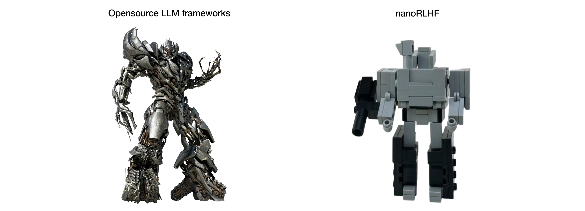

# nanoRLHF

<p align="center">

[](https://github.com/karpathy/nanoGPT)

</p>

This project aims to perform RLHF training from scratch, implementing almost all core components manually except for PyTorch and Triton. 
Each module is a minimal, educational reimplementation of large-scale systems focusing on clarity and core concepts rather than production readiness. 
This includes SFT and RL training pipeline with evaluation, for training a small Qwen3 model on open-source math datasets.

## Motivation
A few years ago, it still felt possible for an individual to meaningfully train and contribute a model, and I was fortunate to do so with [Polyglot-Ko](https://github.com/EleutherAI/polyglot), the first commercially usable open-source Korean LLM, despite not owning a single GPU, thanks to support from the open-source community. 
But as the field entered an era where large companies train [massive](https://huggingface.co/deepseek-ai/DeepSeek-R1) [models](https://huggingface.co/Qwen/Qwen3-235B-A22B) at unimaginable scale and release them freely, individual efforts began to feel small by comparison. 
The same shift happened in libraries. [Open sources](https://github.com/volcengine/verl) [maintained](https://github.com/NVIDIA/Megatron-LM) [by full-time corporate teams](https://github.com/langchain-ai/langchain) quickly outpaced what a single person could sustainably build or maintain. 
I have always loved open source, but in this reality, facing clear limits in time and capital, I found myself stepping back from it for a while. 
Eventually, I reframed the question, not how to compete, but how a single person could still be genuinely useful. 
Inspired by projects like [Karpathy’s nano series](https://github.com/karpathy/nanoGPT), I returned to building small, clear, educational implementations like nanoRLHF, focused not on scale or efficiency, but on understanding and teaching. 
Even without massive resources, I still believe that individuals can create meaningful work that influences and helps others.

## Contents 
| Status  | Packages                                                                          | Description                       | References                                                                                                         | Examples                                                                            |
|---------|-----------------------------------------------------------------------------------|-----------------------------------|--------------------------------------------------------------------------------------------------------------------|-------------------------------------------------------------------------------------|
| 🟢 DONE | [`nanosets`](https://github.com/hyunwoongko/nanorlhf/tree/main/nanorlhf/nanosets) | zero-copy dataset library         | [arrow](https://github.com/apache/arrow), [datasets](https://github.com/huggingface/datasets)                      | [available](https://github.com/hyunwoongko/nanorlhf/tree/main/examples/nanosets.py) |
| 🟢 DONE | [`nanotron`](https://github.com/hyunwoongko/nanorlhf/tree/main/nanorlhf/nanotron) | model and data parallelism engine | [Megatron-LM](https://github.com/NVIDIA/Megatron-LM), [oslo](https://github.com/EleutherAI/oslo)                   | [available](https://github.com/hyunwoongko/nanorlhf/tree/main/examples/nanotron.py) |
| 🟢 DONE | [`nanovllm`](https://github.com/hyunwoongko/nanorlhf/tree/main/nanorlhf/nanovllm) | high performance inference engine | [vllm](https://github.com/vllm-project/vllm), [nano-vllm](https://github.com/GeeeekExplorer/nano-vllm)             | [available](https://github.com/hyunwoongko/nanorlhf/tree/main/examples/nanovllm.py) |
| 🟢 DONE | [`nanoray`](https://github.com/hyunwoongko/nanorlhf/tree/main/nanorlhf/nanoray)   | distributed computing engine      | [ray](https://github.com/ray-project/ray)                                                                          | [available](https://github.com/hyunwoongko/nanorlhf/tree/main/examples/nanoray.py)  |
| 🟡 WIP  | `nanoverl`                                                                        | RLHF training framework           | [verl](https://github.com/volcengine/verl), [OpenRLHF](https://github.com/OpenRLHF/OpenRLHF),                      | not available                                                                       |
| 🟢 DONE | [`kernels`](https://github.com/hyunwoongko/nanorlhf/tree/main/nanorlhf/kernels)   | various triton kernels            | [flash-attention](https://github.com/Dao-AILab/flash-attention/), [trident](https://github.com/kakaobrain/trident) | [available](https://github.com/hyunwoongko/nanorlhf/tree/main/examples/kernels.py)  |

## Pre-requisites
I worked on this project using a single server equipped with 8 H200 GPUs. 
It should also run well on A100 80GB GPUs, but to fully experiment with all features including 3D parallelism, a server with at least 8 GPUs is required.

## Installation
In this project, internal APIs from libraries such as Hugging Face Transformers are used in a hackable way, so all dependency versions except PyTorch are strictly pinned. 
It is strongly recommended to run the code in an isolated environment such as a Conda virtual environment.

```bash
git clone https://github.com/hyunwoongko/nanoRLHF
cd nanoRLHF
pip install -e .
```

## Preparing Dataset
### Supervised training

In the examples included in this project, supervised fine-tuning is performed using [NuminaMath-CoT-Small-Hard-200k](https://huggingface.co/datasets/NotASI/NuminaMath-CoT-Small-Hard-200k). 
From the original dataset, 180k samples are used as training data, and 1k samples are used as validation data.
Running the following command will tokenize the dataset and save it to the specified path.

```bash
bash ./scripts/prepare_sft_data.sh 
```

- Reinforcement Learning
```bash
bash ./scripts/prepare_rl_data.sh 
```

## License
This project is licensed under the Apache 2.0 License.
```
Copyright 2025 Hyunwoong Ko

Licensed under the Apache License, Version 2.0 (the "License");
you may not use this file except in compliance with the License.
You may obtain a copy of the License at

   http://www.apache.org/licenses/LICENSE-2.0

Unless required by applicable law or agreed to in writing, software
distributed under the License is distributed on an "AS IS" BASIS,
WITHOUT WARRANTIES OR CONDITIONS OF ANY KIND, either express or implied.
See the License for the specific language governing permissions and
limitations under the License.
```